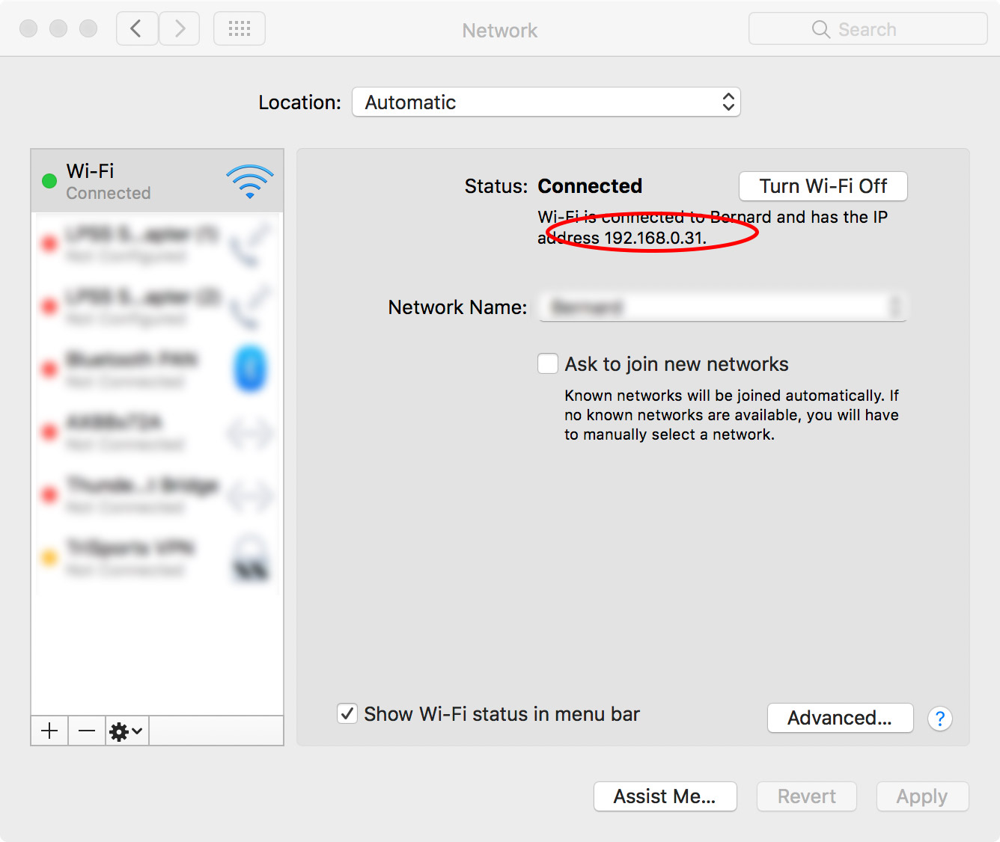

# TCP Chat Server

This app creates a server that uses TCP sockets to allow for real-time telnet chat services over a local server. App features include support multiple users, custom nicknames, error handling and graceful logouts.

# System Requirements

  - Terminal.app on macOS or equivalent
  - node.js and npm package manager installed


### Installation

Clone the repository to your local server
```sh
$ git clone https://github.com/zcrumbo/06-tcp_servers.git
```

Install the dependencies

```sh
$ npm i
```
Start the server

```sh
$ node server.js
```

### Retrieve the IP Address of the server

If you are using macOS, go to System Preferences>Network and get the ip address of the current active network connection


### Connecting

In your terminal window, type the following command, where 'xxx.xx.xxxx' would be replaced with your server's IP address and '3000' would be replaced with your local environment PORT variable, if configured.
```sh
$ telnet xxx.xx.xxxx 3000
```
### Change your nickname
By default, you are assigned a random user nickname when you log in. If you want to change your nickname, you can. For example, to change your nickname to "awesomeName", use the @nickname command with the following steps:
```sh
$ @nickname awesomeName
```

#### Send a broadcast message to everyone in the chat room
Use the @all command
```sh
$ @all Hello!
```
### Send a Direct Message to another user
Use the @dm command, typing the nickname of the user you want to reach.

```sh
$ @dm nickname Hello!
```
#### Log out of the server
Use the @close command
```sh
$ @close
```

### Throw an error
use the @error command
```sh
$ @error
```


